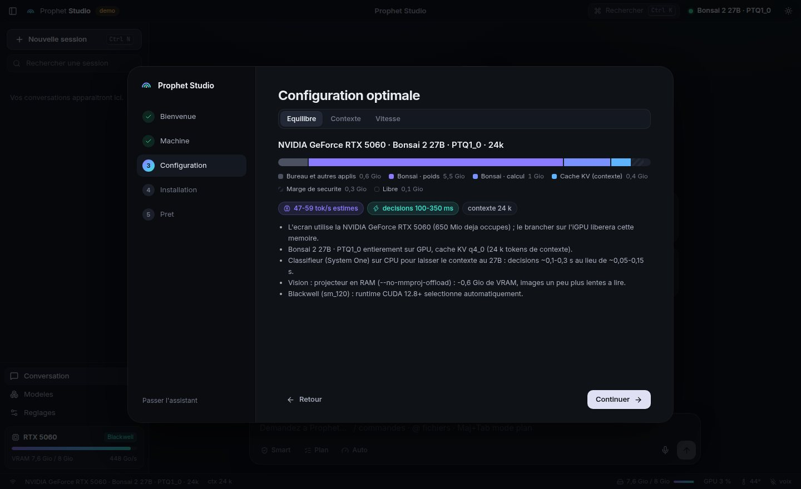
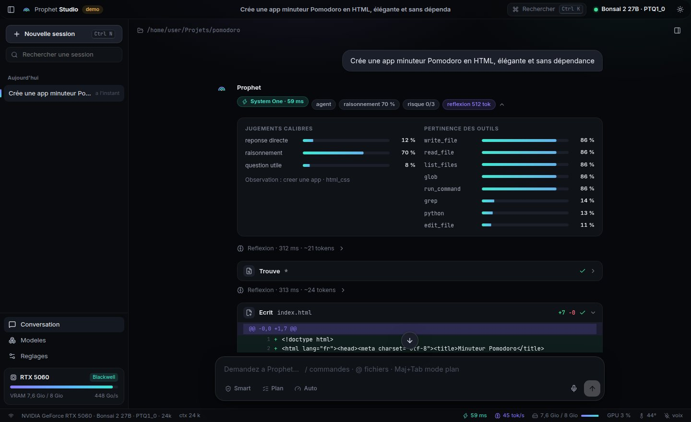
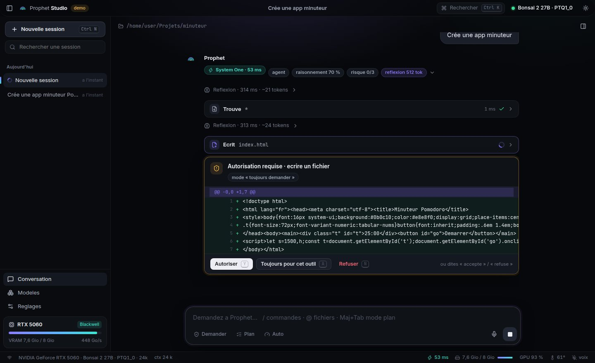

# 12 - Prophet Studio : la plateforme (application, installation, S1 / S2, voix, computer use)

Prophet Studio met la fusion Jev-clone (System One, S1) x Bonsai 2 27B (System Two, S2) dans une application locale : un
coeur Python qui installe, planifie et supervise tout, une interface facon Claude Code (Svelte 5, ~390 Ko de JS non
compresse, polices embarquees, aucun CDN), une application de bureau Tauri 2 et des commandes vocales. Cible : **RTX 5060
8 Go** sous Windows 11 (S2 sur le GPU, S1 sur le CPU) ; le planificateur couvre aussi 4060, 5060 Ti 16 Go, CPU seul, Linux
et macOS. Rien de ce qui suit n'a encore tourne sur les vrais modeles ni sur un vrai GPU : voir la section 10.



## 1. Installer

| Methode | Pour qui | Commande |
|---|---|---|
| Application de bureau | Windows, le plus simple | `Prophet Studio_x.y.z_x64-setup.exe` ou `.msi` : Releases (etiquette `v*`) ou artefacts du workflow **Bureau** (`.github/workflows/desktop.yml`) |
| Une ligne PowerShell | Windows, sans installeur | voir ci-dessous |
| Une ligne shell | Linux / macOS | voir ci-dessous |
| Depuis les sources | developpeurs | `uv sync --extra studio` puis `uv run prophet-studio` |

Tant que la branche `claude/local-llm-high-performance-q4wk6f` n'est pas fusionnee dans `main`, les URL `.../main/installer/...`
repondent 404 : prendre le script sur la branche et lui passer la meme reference (`-Ref` / `--ref`) pour le code.

```powershell
# Windows (RTX 5060 : pilote NVIDIA >= 570)
& ([scriptblock]::Create((irm https://raw.githubusercontent.com/speed25200-cyber/LLM-and-Classifier/claude/local-llm-high-performance-q4wk6f/installer/install.ps1))) -Ref claude/local-llm-high-performance-q4wk6f
```
```bash
# Linux / macOS
curl -fsSL https://raw.githubusercontent.com/speed25200-cyber/LLM-and-Classifier/claude/local-llm-high-performance-q4wk6f/installer/install.sh | sh -s -- --ref claude/local-llm-high-performance-q4wk6f
```
Apres la fusion : `irm https://raw.githubusercontent.com/speed25200-cyber/LLM-and-Classifier/main/installer/install.ps1 | iex`
et `curl -fsSL .../main/installer/install.sh | sh`. Details, prerequis et desinstallation : [`installer/README.md`](../installer/README.md).

Au premier lancement, l'**assistant** : (1) presente les deux cerveaux, (2) verifie la machine (GPU, VRAM, pilote /
CUDA, RAM, disque), (3) montre la configuration optimale et sa barre VRAM, (4) installe en un clic le runtime
llama.cpp adapte au GPU, Bonsai 2 27B, le classifieur et les voix (~7 Go, reprenable, verifie en SHA-256),
(5) demarre les modeles. Sans GPU ni modele : `prophet-studio --demo` fait tout tourner sur de faux serveurs
pour decouvrir l'interface.

## 2. Architecture

```
 Application de bureau (Tauri 2, ~10 Mo)          Navigateur (mode sans installeur)
   fenetre sans cadre, barre systeme,                  http://127.0.0.1:7878
   raccourci global Ctrl+Maj+Espace (parler)                |
          |  lance et surveille le coeur (uv)               |
          v                                                 v
 +------------------------ coeur prophet_studio (FastAPI, 127.0.0.1, jeton) --------------------------+
 | hardware   : NVML / nvidia-smi (RTX 5060 = Blackwell sm_120, 448 Go/s)                              |
 | planner    : budget VRAM -> modele, contexte, place du classifieur ; echelle anti-OOM               |
 | installer  : runtime llama.cpp (CUDA 12.8+ pour Blackwell, cudart Windows), GGUF HF, voix sherpa     |
 | supervisor : 2 llama-server (S2 Bonsai, S1 classifieur), watchdog, OOM -> cran suivant, mode mono    |
 | sessions   : Prophet en flux (SSE -> WebSocket), autorisations, plan, effort, transcription rejouable |
 | calibration: un fichier par classifieur, lie a ses poids                                             |
 | voice      : Parakeet / Whisper, Silero VAD, Piper / Kokoro (CPU) ; grammaire exacte, puis S1       |
 | /v1/chat/completions (proxy Bonsai) · /v1/systemone (format TypeSafe) pour vos autres outils          |
 +-----------------------------------------------------------------------------------------------------+
          |                                   |
   llama-server :7880                  llama-server :7881
   Bonsai 2 27B PTQ1_0 (GPU)           Ternary-Bonsai 1.7B (CPU sur une 5060, GPU si la place le permet)
```

Code : `prophet_studio/` (coeur), `ui/` (interface, construite dans `prophet_studio/web/`), `desktop/` (Tauri),
`installer/`, `jev_clone/` (le moteur S1, l'agent Prophet, le garde-fou, le computer use).

## 3. RTX 5060 : ce que decide le planificateur (`prophet_studio/planner.py`)

Budget = VRAM totale - ce qu'occupent deja le bureau et les autres applications - 256 Mio de marge. Bonsai doit
tenir **entierement** sur le GPU ; on maximise le contexte ; le classifieur va sur le GPU s'il reste de la place,
sinon sur le CPU. Sorties du planificateur (debits = bande passante / taille des poids x efficacite supposee, a
remplacer par des mesures, section 5.7) :

| Carte | Priorite | System Two | Contexte (KV) | System One | Generation estimee |
|---|---|---|---|---|---|
| RTX 5060 8 Go, ecran branche dessus (~650 Mio occupes) | equilibre | Bonsai 2 27B PTQ1_0 | 24 k (q4_0) | ternary-1.7b sur CPU | 47-59 tok/s |
| RTX 5060 8 Go, ecran branche dessus | vitesse | Bonsai 27B Q1_0 | 16 k (q4_0) | ternary-1.7b sur GPU | 53-65 tok/s |
| RTX 5060 8 Go, ecran sur l'iGPU (~100-300 Mio occupes) | equilibre | Bonsai 2 27B PTQ1_0 | 32 k (q4_0) | ternary-1.7b sur CPU | 47-59 tok/s |
| RTX 5060 8 Go, ecran sur l'iGPU (~100-300 Mio occupes) | contexte | Bonsai 2 27B PTQ1_0 | 48 k (q4_0) | ternary-1.7b sur CPU | 47-59 tok/s |
| RTX 5060 Ti 16 Go | equilibre | Bonsai 2 27B PQ2_0 | 32 k (q8_0) | ternary-4b sur GPU | 38-48 tok/s |
| RTX 5060 Ti 16 Go | contexte | Bonsai 2 27B PQ2_0 | 128 k (q8_0) | ternary-4b sur GPU | 38-48 tok/s |
| RTX 4060 8 Go | equilibre | Bonsai 2 27B PTQ1_0 | 32 k (q4_0) | ternary-1.7b sur CPU | 28-36 tok/s |

Pourquoi le classifieur passe sur CPU a 8 Go : Bonsai 2 PTQ1_0 prend 5,52 Gio de poids + ~1 Gio de tampons ; le
classifieur 1.7B demanderait ~1,1 Gio de plus (poids, tampons, KV 8 k en q8_0), soit presque tout le contexte. Sur CPU,
le planificateur estime ~0,1-0,35 s par decision une fois l'etat lu, plus ~0,5-1 s pour lire un etat neuf de ~2 k tokens
(prefill CPU) ; Bonsai garde 24 a 48 k de contexte. Estimations seulement : section 5.1 et 5.7.

Specificites Blackwell :
* **runtime** : la build CUDA 12.8 (ou 13.x) du fork PrismML est choisie automatiquement (`installer.py`,
  `select_runtime_assets`) ; sous Windows le zip `cudart` de la meme version est ajoute. Pilote >= 570 requis ;
  l'assistant le signale sinon.
* **ecran** : si l'ecran est branche sur la 5060, Windows y reserve 0,3-1 Gio ; le brancher sur la carte mere
  (iGPU) donne +8 k de contexte. Detecte par NVML (`display_active`).
* **interface sans VRAM** : l'application de bureau desactive le rendu GPU de WebView2 (reglage "Economie de
  VRAM", actif par defaut) ; animations limitees a transform/opacity, en pause quand la fenetre est cachee.
* **classifieur sur CPU sans VRAM** : `--device none` et `CUDA_VISIBLE_DEVICES=-1` (`supervisor.server_env`) : le
  binaire CUDA ne cree ni contexte ni tampon sur la carte.
* **echelle anti-OOM** (`planner.degrade`) : si llama-server echoue en "out of memory" au chargement, le
  superviseur descend d'un cran et relance seul : 2e slot retire -> vision en RAM -> classifieur sur CPU -> contexte
  reduit -> KV q4_0 -> 4 k -> Bonsai 27B 1-bit -> dechargement partiel. OOM du seul classifieur sur GPU : il passe
  sur CPU sans toucher a Bonsai. L'interface affiche "Configuration ajustee automatiquement".
* **mode mono** : classifieur absent ou en echec -> Bonsai repond aussi aux questions S1 (section 5.4).

Profils equivalents pour les scripts shell : `scripts/profiles/rtx5060-8gb-equilibre.env`,
`rtx5060-8gb-vitesse.env`, `rtx5060ti-16gb.env`.

## 4. L'agent dans l'interface



Chaque tour montre ce que la fusion fait :
1. **Bandeau System One** : voie (reponse directe, agent, ou "direct -> agent" si la voie directe a ete reprise),
   besoin de raisonnement, risque, budget de reflexion accorde a Bonsai, "non calibre" si aucune calibration ne
   s'appliquait a ce tour ; deplie, les jugements, les seuils calibres et la pertinence de chaque outil.
2. **Reflexion** de Bonsai en direct (repliee ensuite, avec sa duree).
3. **Outils** en cartes : diff des fichiers ecrits / modifies (`edit_file` par remplacement exact, economique en
   contexte), sortie de terminal, fichiers trouves, jugements `judge_*`, progression par pas du computer use.
4. **Autorisations** : modes *Smart* (defaut), *Toujours demander*, *Jamais demander* (section 5.5.6). Reponse au clavier
   (Y autoriser, A toujours, N refuser) ou a la voix (« accepte », « refuse », grammaire exacte seulement).
5. **Verification finale** par le classifieur, debit (tok/s), tokens, duree.



| Commande | Effet | Raccourci |
|---|---|---|
| `/nouveau` | nouvelle session | Ctrl+N |
| `/plan` | mode plan : lecture seule, Bonsai rend un plan | Maj+Tab |
| `/profond`, `/rapide` | effort de reflexion du prochain message | |
| `/smart`, `/demander`, `/auto` | autorisations : Smart, Toujours demander, Jamais demander | |
| `/fichiers` | panneau Espace de travail (fichiers, autorisations memorisees) | Ctrl+B |
| `/modeles`, `/reglages`, `/bench` | ecrans et mesure | Ctrl+, |
| `/lire`, `/mainslibres` | voix | Ctrl+Maj+Espace (parler) |
| palette | toutes les commandes et sessions | Ctrl+K |
| `@chemin` | mentionner un fichier (autocompletion) | |
| Echap | arreter la generation / la voix | |

## 5. Le classifieur (System One) et Bonsai (System Two)

### 5.1 Ce qu'est S1 aujourd'hui

* **Moteur** : `jev_clone` (le clone maison de Jev TypeSafe). Une decision typee (`noul` = oui/non, `choice`, `score`) est
  lue sur les logits de llama-server : une requete `/completion` par question avec `n_predict = 1` et une grammaire qui
  n'admet que les etiquettes (A..Z, Yes/No) ; la distribution renvoyee est renormalisee sur les etiquettes ; aucun texte
  n'est genere. Les questions d'un meme etat partagent le cache du prefixe.
* **Modele** : un GGUF **Ternary-Bonsai de PrismML tel quel, en zero-shot**. Aucun clone entraine n'est publie. Choix
  automatique selon la VRAM totale : 1.7B (< 11 500 Mio, et sans GPU), 4B (>= 11 500 Mio), 8B (>= 20 000 Mio) ; ou un
  GGUF importe (section 5.3).
* **Sur une RTX 5060 8 Go** (priorite equilibre ou contexte) : S1 sur CPU, **un slot** de 8 k tokens (KV q8_0), 2 a 8
  threads ; les questions d'un etat neuf passent en sequence sur le meme cache. Estimation du planificateur :
  **100-350 ms par decision une fois l'etat lu**, plus le prefill de chaque etat neuf (~0,5-1 s pour ~2 k tokens). Un tour
  agent lit plusieurs etats neufs : pre-tour, pertinence des outils, chaque action jugee, verification. Priorite vitesse :
  S1 sur GPU (2 a 4 slots), 40-150 ms estimes. Rien de cela n'est mesure (section 5.7).

### 5.2 « Calibre » : ce que ca veut dire

* **Sans calibration** : pourcentages bruts (temperature 1) et portes par defaut (section 5.5). Le bandeau S1 affiche
  "non calibre".
* **Calibrer** : ecran Modeles, bouton **Calibrer** (S1 en marche, hors mode mono), ou
  `python -m jev_clone.calibrate --server http://127.0.0.1:7881 --studio-model <id>`. La calibration lit avec le S1 en
  marche (lecture brute) les 82 graines etiquetees livrees (`jev_clone/seeds/prophet_seeds.jsonl`, demandes FR/EN etiquetees
  `direct`, `clarify`, `needs_reasoning`, `risk`, `intent`, `language`) et ajuste, **pour chaque question du pre-tour** :
  une temperature (minimum de NLL) et un seuil **par decision** (`gates`) : la plus petite probabilite telle que les seules
  lectures qui retiennent cette option soient justes a 95 % (cible par defaut). Aucune valeur n'atteint la cible : `null`,
  Prophet ne prend jamais seul cette decision ("voie directe coupee par la calibration").
* **Portee** : une temperature ne s'applique qu'a la meme question (empreinte : type, consigne, options) lue sur un etat
  de meme forme (cle `request`). Donc **le pre-tour seulement** : garde-fou, pertinence des outils, verification, voix,
  computer use et `judge_*` restent lus bruts, avec leurs seuils fixes.
* **Lien aux poids** : `<donnees>/runs/calibration/<id>.json` enregistre le GGUF calibre (chemin, taille, date, empreinte
  SHA-256 du premier et du dernier Mio). GGUF remplace, deplace ou autre fichier pour ce modele : calibration perimee,
  jamais appliquee, signalee dans l'ecran Modeles. Re-importer un GGUF sous le meme id efface sa calibration.
* **Jamais appliquee** : en mode mono ; calibration generique (temperature seule, par exemple celle ecrite par
  `train_lora_rlcd.py`) ; fichier dont aucune question n'est reconnue. **Seuils perimes** (fichier sans `meta.version`
  >= 2) : temperatures appliquees, seuils ignores (portes par defaut), signale "seuils a recalculer".
* **Import** : ecran Modeles > Importer une calibration (`calibration.json` du notebook ou d'une autre machine) ; refuse
  si le fichier a ete fait pour un autre modele (`meta.model_id`).

### 5.3 Entrainer un clone et l'importer

Chaine complete : [`training/README.md`](../training/README.md), notebook A100 `colab/jev_bonsai_a100.ipynb`
([docs/05](05-COLAB-A100.md)). Jamais executee sur de vrais poids dans ce depot (tests sur faux serveurs et faux outils).
1. Donnees au format exact des appels de Prophet : `python training/make_synthetic_prophet.py --out data/train.jsonl
   --val data/val.jsonl --calib data/calib.jsonl --n 20000` (option `--teacher http://127.0.0.1:7880` : Bonsai 2 27B
   enseignant ; `training/make_from_trajectories.py` : pas du computer use repris par Bonsai).
2. Entrainement : `training/train_lora_rlcd.py` (QLoRA, LoRA ou `--full` ; NLL ou Brier sur les etiquettes + KL vers
   Bonsai).
3. Export : `training/merge_lora.py` -> GGUF f16, Q8_0, Q4_K_M (fork PrismML au tag du runtime de Studio).
4. Studio : **Modeles > Importer un GGUF**, role **Classifieur** (id `custom-s1-...` tire du nom du fichier, choisi pour le
   prochain demarrage), redemarrer les modeles, puis **Calibrer** (ou importer le `calibration.json` calcule sur `data/calib.jsonl`).
5. Comparer avant / apres : `python training/eval_clone.py --server http://127.0.0.1:7881 --data data/val.jsonl`.

### 5.4 Mode mono

* **Quand** : classifieur non installe au demarrage, echec de son demarrage, ou arret inattendu non rattrape (5.5.10).
* **Effet** : les questions S1 vont a Bonsai (meme lecture par grammaire, pourcentages bruts, aucune calibration). Bonsai
  prend un 2e slot seulement si le classifieur etait absent au lancement et que la memoire rendue le permet (VRAM prevue
  pour un S1 sur GPU, ou RAM si Bonsai tourne sur CPU). Sur une RTX 5060 en equilibre (S1 prevu sur CPU), Bonsai garde un
  slot : les lectures S1 attendent la fin de la generation en cours. Decisions plus lentes, non mesurees.
* **Retour** : un classifieur installe apres coup (ou dont le fichier change) demarre sans relancer Bonsai et le duo revient.

### 5.5 Les mecanismes de cooperation

**5.5.1 Pre-decision (chaque tour).** Une requete S1, 6 questions, sur l'etat `{request (2 500 caracteres max),
workspace_files (60), recent_turns (4 x 400 caracteres)}` : `direct` (noul), `clarify` (noul, simple indice pour Bonsai),
`intent` et `language` (choice, observation seulement : journal, entrainement), `needs_reasoning` (noul), `risk` (score
0-3). Classifieur en panne : `direct` 0, `needs_reasoning` 1, `risk` 1, voie agent, et Bonsai est prevenu que le juge
rapide est absent.

**5.5.2 Voie directe et reprise en voie agent.** Voie directe si tout est vrai : `direct` >= max(0,5, seuil) (seuil 0,8 sans
calibration, seuil calibre de la decision 'oui' sinon) ; sans reflexion (`needs_reasoning` < 0,5 et, si calibre,
1 - `needs_reasoning` >= son seuil 'non') ; risque de niveau 0 (sans calibration : esperance arrondie ; calibre : niveau le
plus probable, et probabilite du niveau 0 >= son seuil) ; effort different de "profond" ; hors mode plan. Bonsai repond alors
sans outils, sans reflexion, en 600 tokens au plus. Reprise en voie agent si la reponse est vide, contient `NEEDS_TOOLS`,
est tronquee, pretend avoir cree / modifie / execute quelque chose ou ne pas avoir acces, ou si la verification S1 est
< 0,35 ; budget alors >= 512 (sauf effort rapide). Le bandeau affiche "direct -> agent" et la raison.

**5.5.3 Budget de reflexion.** Niveau de risque 0 / 1 / 2 / 3 -> 0 / 512 / 2 048 / 6 144 tokens ; au moins 512 si
`needs_reasoning` ou si la lecture du risque n'est pas sure ; effort rapide = 0, profond = 6 144. Plafond : 60 % de
`max_tokens` (Studio : `max_tokens` = contexte / 3, borne a [1 024, 8 192], soit 8 192 et un plafond de 4 915 a 24-32 k).
Envoye par requete (`thinking_budget_tokens` ; 0 coupe aussi `enable_thinking`).

**5.5.4 Pertinence des outils.** Une requete S1 : un noul par outil du catalogue hors `done`, `remember`, `create_tool`,
sur la demande (2 000 caracteres) et les 4 derniers echanges. Sert a l'ordre de presentation ; au-dela de 12 outils
(`max_tools` : 9 + les 3 de base), les moins pertinents ne sont pas exposes. Catalogue par defaut : 8 outils hors base,
donc aucun filtre, seulement l'ordre ; `browse`, `desktop` et les outils crees par Prophet s'y ajoutent. Les `judge_*` sont
toujours exposes. Classifieur en panne : ordre du catalogue.

**5.5.5 Garde-fou** (`jev_clone/guard.py`, meme verdict pour les outils de Prophet et les pas du computer use).
* Une passe S1, 3 questions : `tool_risk` (choice parmi 5 classes : `readonly`, `workspace_write`, `destructive`,
  `privileged`, `exfiltration`), `risk` (score 0-3), `policy_violation` (noul). `p_risky` = masse de probabilite
  destructive + privileged + exfiltration (la masse compte, pas seulement l'option en tete).
* **Arret obligatoire** (`hard_stop`) : classe en tete risquee, `p_risky` >= 0,5, `policy_violation` >= 0,5, `risk` >= 2,5,
  classifieur en panne, action trop longue pour etre vue en entier, script lance mais invisible, action qui vise
  `.prophet/skills`.
* **Confirmation** (`needs_confirmation`) : arret obligatoire, ou `p_risky` >= `danger_threshold` (0,35), ou `risk` >= 1,5.
* **Ce qui passe par le garde-fou** : `run_command`, `python`, `create_tool`, chaque appel d'un outil cree par Prophet (son
  code est montre), `browse`, `desktop`, et `write_file` / `edit_file` hors mode Jamais demander.
* **A l'ecriture** : seul un fichier qui peut s'executer est juge (suffixe de script, nom connu comme `Makefile` ou
  `package.json`, sans extension, sous `.git`, `.githooks`, `.husky`, `.vscode`, `.github`, ou commencant par `#!`) ; une
  retouche montre la modification et le fichier qui en resulte (entier jusqu'a 16 000 caracteres, sinon la zone modifiee
  +/- 3 000). Un fichier de donnees (html, css, md, txt) n'est pas juge a l'ecriture : il l'est **a l'execution**, quand une
  commande le lance. `.prophet/` n'est jamais ecrit par les outils de fichiers.
* **Analyse des commandes** (au mieux ; le juge voit toujours la commande entiere) : le contenu de chaque fichier que la
  commande execute est ajoute a ce qui est juge : script passe a un interpreteur quel que soit son suffixe, programme du
  workspace (`./run`), `python -m`, code de `-c` / `-Command` / `eval` (analyse a son tour), `-EncodedCommand` decode, entree
  standard d'un interpreteur (`sh < f`, `cat f | sh`), evaluation indirecte (`Get-Content f | iex`, `eval $(cat f)`, `. .\f`),
  hooks git, `Makefile` / `justfile`, `package.json`, repertoire courant suivi (`cd`). Script lance mais introuvable (nom de
  script ou chemin relatif), calcule a l'execution (`$VAR`), reecrit par la commande elle-meme, ou `-EncodedCommand`
  illisible : arret obligatoire.
* **Decoupage** : texte juge en fenetres de 2 000 caracteres qui se chevauchent de 300 (une instruction coupee a une
  frontiere reste entiere dans l'une d'elles), chacune precedee de la ligne d'action ; le pire verdict l'emporte. Budget :
  24 fenetres (~40 k caracteres) ; au-dela, la premiere partie et la fin sont jugees et l'action devient un arret
  obligatoire.
* **Cache des verdicts** : un meme etat juge (demande, texte, seuils) n'est relu qu'une fois tant que le moteur S1 vit
  (512 verdicts, reconstruit si le classifieur ou sa calibration change) ; seulement devant un vrai llama-server ; une panne
  n'est jamais mise en cache.

**5.5.6 Autorisations** (`ui/src/lib/perm.ts`, reglage par defaut : Smart).

| Mode | Outils de Prophet | Pas du computer use |
|---|---|---|
| **Smart** | le classifieur juge ; demande seulement si confirmation requise (dont les arrets obligatoires) | pas risque : demande |
| **Toujours demander** | chaque action gardee est demandee (avec le verdict du classifieur quand il juge) | seuls les pas juges risques |
| **Jamais demander** | aucune question, le classifieur n'est pas consulte, aucun arret obligatoire (seule l'ecriture dans `.prophet/` reste refusee) | les pas restent juges mais s'executent sans question |
| mode plan (`/plan`) | toute action qui modifie est refusee ; outils crees ni charges ni executes | - |

**« Toujours pour cet outil »** : autorisation memorisee pour la session, par couple (outil, classe jugee par S1), ou par
outil pour une action non jugee (fichier de donnees en mode Toujours demander). Jamais proposee pour un arret obligatoire
ni pour un verdict incertain (`needs_confirmation`) : elle ne couvre que ce que Smart aurait laisse passer ; en pratique
elle ne sert qu'en mode Toujours demander. La voix n'en cree jamais. **Revocation** : panneau Espace de travail (Ctrl+B),
une par une ou "Tout revoquer" ; un tour en cours la perd aussitot (API : `GET` / `DELETE /api/sessions/{id}/always_allow`).

**5.5.7 Verification.** Apres la voie agent (sauf Stop) et avant de livrer une voie directe : noul "la reponse (et l'etat
du workspace) satisfait-elle la demande ?" sur la demande, la reponse et 60 fichiers. Voie directe : < 0,35 -> reprise en
voie agent. Voie agent : affichee et journalisee, ne change rien.

**5.5.8 Bonsai consulte S1 (`judge_*`).** Pendant la voie agent (mode plan compris), Bonsai dispose de `judge_choice`
(2 a 26 options), `judge_noul`, `judge_score` (2 a 10 niveaux), `judge_rank` (jusqu'a 50 candidats, un noul chacun) et
`judge_batch` (format `/v1/systemone`). Lecture brute ; chaque appel compte dans les statistiques S1 du tour et figure
dans son journal.

**5.5.9 Journal.** Chaque tour : `<espace de travail>/.prophet/ledger.jsonl` (pre-decision, voie, outils exposes et
appeles, blocages, verification, statistiques S1 / S2).

**5.5.10 Replis.**
* **S1 tombe pendant un tour** : le tour garde son moteur ; chaque lecture echoue et prend son repli : pre-decision de
  repli (5.5.1), ordre du catalogue, garde-fou en arret obligatoire (confirmation meme en Smart ; Jamais demander ne
  consulte pas S1), verification absente.
* **Watchdog** (toutes les 2 s) : S1 arrete tout seul -> mode mono immediat pour les tours suivants et une relance dans son
  propre fil (jusqu'a 180 s) ; 2e arret ou relance ratee -> mode mono jusqu'a ce que le fichier du classifieur change.
* **S2 arrete tout seul** : relance une fois avec les memes arguments (etat "starting", "redemarrage de Bonsai" dans la
  barre d'etat) ; 2e arret -> etat error. Le tour en cours s'arrete sur une erreur.

**5.5.11 Voix** (`prophet_studio/voice.py`). (1) mot d'eveil retire (obligatoire en mains libres) ; (2) grammaire exacte
FR/EN -> commande immediate ; (3) enonce de 8 mots au plus -> une lecture S1 (choice parmi les commandes + "demande pour
l'agent", lue brute) : commande seulement si sa probabilite >= 0,72 (reglage `command_threshold`) ; (4) sinon, la phrase part
a l'agent. **Accepter / refuser une autorisation n'agit que sur la phrase exacte de la grammaire** : si seul S1 y voit une
reponse, l'interface demande de dire exactement « accepte » ou « refuse ». Classifieur indisponible : la phrase part a
l'agent.

**5.5.12 Computer use** (`jev_clone/computer_use.py`, `desktop_use.py` ; details en section 7).
* **Voie rapide** : une requete S1 par pas : action (click, type, scroll_down, go_back, done, escalate), objectif atteint
  (noul), un noul par element candidat (40 elements observes au plus, 24 candidats pre-classes par mots communs avec
  l'objectif), slot a saisir (le texte tape vient toujours des slots fournis, jamais du modele). Portes : action p >= 0,5 et
  marge >= 0,2 sur la deuxieme ; cible p >= 0,5 et marge >= 0,15 ; slot p >= 0,5 et marge >= 0,2 ; `done` seulement si
  objectif atteint >= 0,6 ; sinon, ou si S1 choisit `escalate` ou echoue, le pas part a Bonsai.
* **Garde par pas** : clic, saisie, raccourci et lancement d'application juges avant execution (meme verdict que 5.5.5) ;
  un pas rapide risque est confie a Bonsai, dont l'action demandera l'autorisation.
* **Verification** apres chaque action rapide (noul "progres ?") : < 0,4 ou action en echec deux fois de suite, ou
  verification impossible -> Bonsai.
* **Bonsai** (escalade) : outils click, type, scroll_down, go_back, observe, done (+ press_keys, open_app au bureau) et
  `judge_*` ; 6 tours d'outils par escalade, reflexion <= min(2 048, 60 % de sa generation) ; 8 escalades au plus par
  tache, arret apres 2 echecs de Bonsai consecutifs ; 20 pas (navigateur) ou 24 (bureau). Apres un pas refuse,
  `done(achieved=true)` n'est un succes que si S1 relit l'ecran et le confirme (>= 0,6).
* **Stop** : verifie a chaque pas et coupe la generation de Bonsai en cours.
* **DAgger** : trajectoires dans `<donnees>/runs/trajectories.jsonl` (navigateur) et `desktop_trajectories.jsonl` (bureau) ;
  `python training/make_from_trajectories.py --in ... --out data/computer_use.jsonl` : pas repris par Bonsai = exemples
  etiquetes, pas rapides verifies >= 0,8 = auto-etiquetage, action refusee jamais prise comme etiquette.

### 5.6 Dans la bibliotheque, pas dans Studio

| Code | Etat |
|---|---|
| `jev_clone/fusion.py` (`FusionRouter`, `GatePolicy` : porte par seuil calibre, escalade vers Bonsai) | **bibliotheque seulement** : utilise par `jev serve` (`POST /v1/fusion/decide`) et `examples/ticket_routing.py`. Le `/v1/systemone` de Studio repond avec le moteur S1 seul. |
| `jev_clone/guided.py` (`GuidedGenerator` : S1 dans le decodage de Bonsai, meilleur de N, reponse verifiee) | **bibliotheque seulement** : Studio fixe le budget de reflexion avant la generation, S1 n'intervient pas pendant. |
| `jev_clone/conformal.py` (ensembles conformes, porte a risque controle) | **bibliotheque seulement** : ni Studio ni `calibrate.py` ne l'utilisent. |
| `jev_clone/engine_torch.py` (passe unique PyTorch) | **bibliotheque seulement**, jamais execute ici (pas de torch / GPU). |

### 5.7 Mesurer sur la RTX 5060

Depuis un clone du depot, Prophet Studio lance (application de bureau ou `prophet-studio`, modeles installes ; arretes,
la mesure les demarre) :

```powershell
powershell -ExecutionPolicy Bypass -File .\scripts\measure_rtx5060.ps1
powershell -ExecutionPolicy Bypass -File .\scripts\measure_rtx5060.ps1 -Rapide -Label "pilote 581.57"
```
Le script lit `core.json` (`-DataDir`, sinon `PROPHET_HOME`, sinon `%LOCALAPPDATA%\ProphetStudio`), lance
`python -m eval.measure_duo --studio --demarrer` avec le Python installe (`app-venv`, sinon `venv`, sinon `uv run`), ecrit
`eval\results\duo-<date>.json` et copie dans le presse-papiers le tableau "Duo reel" a coller tel quel dans
[`eval/SCOREBOARD.md`](../eval/SCOREBOARD.md) (~5 min, ~2 min avec `-Rapide`). Linux / macOS : `sh scripts/measure.sh`.
Sans Studio, contre deux llama-server : `uv run python -m eval.measure_duo --s1 http://127.0.0.1:8081 --s2 http://127.0.0.1:8080`.

Ce qui est mesure : latence S1 a froid (etat neuf de ~2 k tokens) et a chaud, par type de question et pour les lectures
reelles d'un tour (pre-tour, outils, garde-fou) ; masse sur les etiquettes avec et sans grammaire ; S2 generation, prefill,
premier token ; respect du budget de reflexion (0 puis 512) ; un tour voie directe et un tour voie agent de bout en bout ;
VRAM avant / pic / apres (nvidia-smi). Le bouton **Mesurer** (`POST /api/bench`, `runs/bench.jsonl` du dossier de donnees)
donne une mesure plus courte.

Tests en direct (sautes sans ces variables) :
```powershell
$env:JEV_TEST_S1 = 'http://127.0.0.1:7881'; $env:JEV_TEST_S2 = 'http://127.0.0.1:7880'
uv run --extra dev pytest -q tests/test_live_duo.py        # un tour Prophet complet (voie agent) + plomberie de la mesure
$env:JEV_TEST_SERVER = 'http://127.0.0.1:7881'
uv run --extra dev pytest -q tests/test_live_llamacpp.py tests/test_values_mode.py tests/test_guided.py
```
Chaine d'entrainement : `JEV_TEACHER_URL` (Bonsai, 7880), `JEV_S1_EVAL_URL` (classifieur, 7881), `MERGE_LORA_ADAPTER` +
`LLAMA_CPP_DIR` (`tests/test_train_chain.py`).

## 6. Voix

* **Push-to-talk** : maintenir le bouton micro ou Ctrl+Maj+Espace (global dans l'application de bureau) ; le son
  part en PCM 16 kHz au coeur, qui transcrit (Parakeet TDT 0.6B v3, 25 langues dont le francais, ou Whisper).
* **Mains libres** : flux continu vers le detecteur de parole (Silero) du coeur ; seuls les enonces commencant
  par le mot d'eveil (« Prophet, … », « OK Prophet », « Dis Prophet ») sont pris en compte.
* **Synthese** : Piper (voix francaise Siwis, anglaise Lessac) ou Kokoro ; lecture phrase par phrase ; sans
  modele installe, la voix du systeme prend le relais (Web Speech).
* Tout tourne sur **CPU** : la VRAM reste a Bonsai. Routage d'un enonce : section 5.5.11.

| Commande | Exemples |
|---|---|
| new_session | « nouvelle session », « new chat » |
| stop | « stop », « arrete », « annule », « tais-toi » |
| approve / deny | « accepte », « vas-y », « refuse », « non » (grammaire exacte seulement) |
| send, clear_input | « envoie », « efface » |
| read_last | « lis la reponse », « relis » |
| plan_on / plan_off | « mode plan », « quitte le mode plan » |
| effort_deep / effort_fast | « reflechis bien », « reponds vite » |
| open_settings / open_models | « ouvre les reglages », « ouvre les modeles » |
| mute | « coupe le micro » |

## 7. Computer use

Desactive par defaut ; reglages "Outil navigateur (computer use)" et "Controle du bureau (computer use)". Un outil
active mais indisponible n'est jamais propose a Bonsai (l'ecran Reglages dit pourquoi).
* **Navigateur** (`browse`) : Playwright et Chromium, navigateur invisible (headless), arbre ARIA. **Playwright n'est pas
  dans l'extra `studio`** : les installeurs ne l'installent pas ; il faut l'ajouter a l'environnement Python de Studio
  (`<donnees>/app-venv` des scripts, `<donnees>/venv` de l'application de bureau, `.venv` depuis les sources), par exemple
  `uv pip install --python <python de cet environnement> playwright` puis `<python> -m playwright install chromium`
  (non essaye ici ; l'ecran Reglages dit si l'outil est disponible).
* **Bureau** (`desktop`, Windows seulement) : l'arbre **UI Automation** de la fenetre active (paquet `uiautomation`,
  installe par l'extra `studio` sous Windows) joue le role de l'arbre ARIA ; Bonsai a en plus `press_keys` et `open_app`.
* L'appel de l'outil est juge comme les autres actions, puis chaque pas (section 5.5.12). Pas de capture d'ecran ni de
  vision dans Studio : le clone et Bonsai decident sur l'arbre texte. Progression par pas dans la carte de l'outil.

## 8. API locale et securite

Le coeur peut executer des commandes : il n'ecoute que sur 127.0.0.1 et exige un **jeton** tire au lancement
(en-tete `X-Prophet-Token` ou `Authorization: Bearer`), un en-tete `Host` local (parade au DNS rebinding) et une
`Origin` absente ou autorisee (l'interface elle-meme, l'application Tauri). Le jeton est ecrit dans
`core.json` (droits 600) et injecte dans la page servie.

Pour brancher d'autres outils : `POST /v1/chat/completions` (Bonsai, compatible OpenAI, diffusion comprise) et
`POST /v1/systemone` (decisions typees au format TypeSafe, lues par le classifieur en marche ; en mode mono par Bonsai,
champ `mono` de la reponse) avec `Authorization: Bearer <jeton>`.

## 9. Developper

```bash
uv sync --extra studio --extra dev
uv run prophet-studio --demo                      # faux serveurs, interface complete
cd ui && npm install && npm run dev               # interface en rechargement a chaud (coeur lance avec --dev --token dev)
cd ui && npm run check && npm run build           # verifie les types et reconstruit prophet_studio/web
uv run pytest -q                                  # coeur, agent, voix, bureau, API : sans GPU (faux llama-server)
cd desktop && npm ci && npm run sidecar && npm run dev   # application de bureau (voir desktop/README.md)
```

`uv.lock` fige les versions : les installateurs et l'application de bureau l'embarquent (installations
reproductibles). La CI (`.github/workflows/ci.yml`) lance les tests Python sous Linux et Windows (Python 3.11, Chromium de
Playwright), verifie et construit l'interface, et passe `cargo fmt` / `clippy` / `test` sur la coquille ; `desktop.yml`
construit les paquets (NSIS + MSI sous Windows, deb + AppImage sous Linux, app + dmg sous macOS Apple Silicon) sur une
etiquette `v*`, un lancement manuel ou une modification de `desktop/`.

## 10. Ce qui est verifie, ce qui ne l'est pas

Verifie ici (Linux, sans GPU) :
* `uv run --no-sync pytest -q` : **349 tests passent, 9 sont sautes**. Les 9 attendent de vrais serveurs :
  `JEV_TEST_SERVER` (4), `JEV_TEST_S1` / `JEV_TEST_S2` (2), `JEV_TEACHER_URL`, `JEV_S1_EVAL_URL`, `MERGE_LORA_ADAPTER` +
  `LLAMA_CPP_DIR` (3).
* le coeur de bout en bout contre de faux llama-server lances par le vrai superviseur : plan RTX 5060, demarrage,
  echelle anti-OOM, watchdog et mode mono, tours d'agent en flux, voie directe et reprise, autorisations et revocation,
  garde-fou (tests de regression de l'analyse des commandes et du decoupage), calibration par modele, annulation, mode
  plan, securite (jeton, Host, Origin), WebSocket, voix (bibliotheque sherpa_onnx factice de meme API), bureau simule,
  proxies /v1, `eval/measure_duo.py` contre de faux serveurs et contre Studio en mode demo ;
* l'interface et la voix pilotees par Chromium (Playwright), l'agent navigateur sur une page locale ;
* plus tot dans le developpement : l'application de bureau sous Linux (Xvfb : AppImage et .deb, coeur, fermeture, jeton),
  `install.sh` (installation reelle) et `install.ps1` (sous PowerShell 7 pour Linux).

Configure dans la CI (etat de chaque commit : onglet Actions du depot) : tests Python sur `ubuntu-latest` et
`windows-latest` ; interface (`npm run check`, `npm run build`) ; coquille Tauri (`cargo fmt`, `clippy`, `test`) ; paquets
NSIS + MSI (`windows-latest`), deb + AppImage (`ubuntu-22.04`), app + dmg (`macos-14`) : construits, jamais executes.

Non verifie :
* **rien n'a tourne sur les vrais modeles** (Ternary-Bonsai, Bonsai 2 27B) **ni sur un vrai GPU** : latences S1, debits
  S2, qualite des decisions zero-shot, contexte obtenu sans OOM, VRAM reelle sont des estimations (section 5.7 pour les
  mesurer) ;
* la calibration et les seuils sur un vrai classifieur ; aucun clone entraine n'existe ; la chaine d'entrainement n'a
  jamais tourne sur de vrais poids ;
* les installeurs construits par la CI (NSIS, MSI, dmg) n'ont jamais ete executes sous Windows ni macOS ; l'application
  de bureau sous Windows (WebView2, Job Object, gain de VRAM de `--disable-gpu`) et macOS ;
* UI Automation sur un vrai Windows, la voix avec les vrais modeles, le micro de WebKitGTK sous Linux ;
* les noms exacts des assets de la release PrismML pour Windows (choix sur la liste reelle, noms construits en repli) et
  des archives vocales sherpa-onnx ;
* le garde-fou n'a eu qu'une revue adversariale (la seconde n'a pas pu tourner) : tests unitaires et de regression
  seulement ; l'analyse des commandes est faite au mieux.
